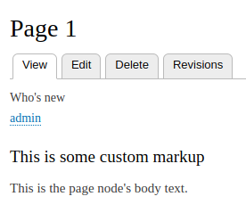
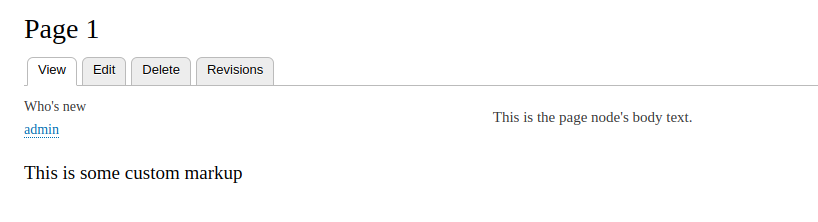

# Seem

Seem is a site-building tool for coders.

Seem allows you to take control over the rendering of Drupal things like nodes,
views, or blocks (we call these things 'renderables').

Seem solves the same kinds of problems that modules such as page manager,
panels, and display suite solve - allowing targeted placement of content in a
Drupal theme.

However, Seem is a module which is more for developers than for site-builders.
It allows developers to define displays in code. In this way, it is possible
to implement sophisticated rendering and theming, controlling everything in
your code.

## Installation

Just like any other Drupal module:

```
drush dl seem
drush en -y seem
```

## Getting started

This is a very basic tutorial, it just scratches the surface of what is possible
with Seem.

Once you have read this tutorial, you can take a look at some more complex
examples in the seem_examples module.

But for now, let's get started with the basics.

# Add a Seem display to an existing theme

You can use any theme you like. For this example, let's first create a sub-theme
of Bartik:

```
cd path/to/drupalroot
mkdir -p themes/bartikseem
cd themes/bartikseem
```

Within the themes/bartikseem directory, create the following
```barktikseem.info.yml``` file:

```
name: Bartikseem
type: theme
description: This is a sub theme of Bartik
core: 8.x
base theme: bartik
```
You can now browse to 'admin/appearance', look for 'Bartikseem' and click
'Install and set as default'.

Please make sure that your Bartikseem sub-theme is enabled and active, otherwise
the rest of this tutorial will not work. You can confirm this by browsing to
'admin/appearance'.

Now that we have a sub-theme, we can demonstrate how Seem works.

In this example, we will use Seem to alter the rendering of a node of type
'page'.

So, if you don't have one already, go to 'node/add/page', and create a page
node.

Within your Bartikseem sub-theme, create a ```seem_display``` directory.

```
cd path/to/drupalroot
mkdir -p themes/bartikseem/seem_display
```

In the ```seem_display``` directory, create a file named ```seem_example.entity.seem_display.yml```.

The file naming convention is as follows:

- seem_example - this is an arbitrary string, it can be whatever you like.
- entity - this is the displayable plugin type - in our case, it means that we
are about to alter the rendering of an entity (a page node, to be precise).
- seem_display.yml - this tells Drupal that we are about to define a
seem_display plugin.

Edit ```seem_example.entity.seem_display.yml``` as follows:

```
label: 'Seem example'
context:
  entity_type: 'node'
  bundle: 'page'
  view_mode: 'default'
regions:
  content:
    -
      type: view
      name: who_s_new
      display_id: block_1
    -
      type: markup
      markup: '<h1>This is some custom markup</h1>'
    -
      type: main_content
```

So, what is going on here? Let's go through the yml file line-by-line.

```
label: 'Seem example'
```
This is an administrative label, you can see it in the user interface here:
admin/structure/seem_display

```
context:
  entity_type: 'node'
  bundle: 'page'
  view_mode: 'default'
```
This is our context. Here, we are saying that Seem will take control of the
rendering of all nodes of type 'page', when the view mode is 'default'.

```
regions:
  content:
    -
      type: view
      name: who_s_new
      display_id: block_1
    -
      type: markup
      markup: '<h1>This is some custom markup</h1>'
    -
      type: main_content
```
This is the content that we are going to use as our replacement content.
In this case, it consists of the following:
- A view (the who's new view: admin/structure/views/view/who_s_new)
- Some custom markup
- The main content from the context: right now, our context is the node, so
we want to display the node's main content.

Don't forget to clear the cache.
```
drush cr
```

Now, load a page node in the browser. You will see that the rendering of the
node has been taken over. Instead of the node's main content, we see the view,
some markup, and then (finally) the node's main content.



## Layout integration

Let's now change the layout, so that instead of a single-column layout, we can
have some things on the left, and some on the right.

To do this, we need a layout. We can use layouts from any source that implements
the layout_plugin module.

For seem, layout_plugin is a dependency, so it will already be enabled.

So that we can use the layout_example_2col layout, let's enable the
```layout_plugin_example``` module:

```
drush en layout_plugin_example
```

Now, we can inject our content into a layout.

Edit ```themes/bartikseem/seem_display/seem_example.entity.seem_display.yml```
as follows, adding the ```layout_example_2col``` layout with ```left``` and
```right``` ```regions```:

```
label: 'Seem example'
layout: layout_example_2col
context:
  entity_type: 'node'
  bundle: 'page'
  view_mode: 'default'
regions:
  left:
    -
      type: view
      name: who_s_new
      display_id: block_1
    -
      type: markup
      markup: '<h1>Hello world</h1>'
  right:
    -
      type: main_content
```

Don't forget to rebuild your cache.

```
drush cr
```

Now reload the page, you will see content in the left and right regions of the
layout.



# Additional notes
In order to be able to use the seem active config, you need to make sure that
the following patch is applied to your drupal core:
https://www.drupal.org/files/issues/core-contextual-ajax-2764931-7.patch
